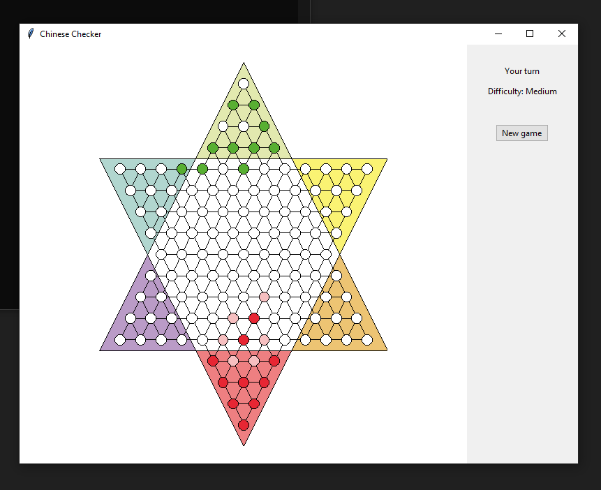
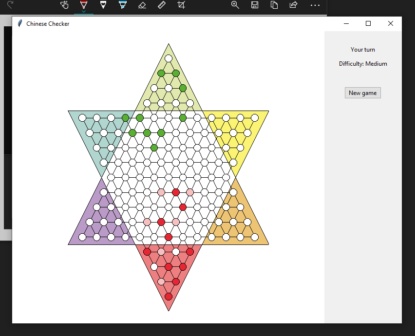
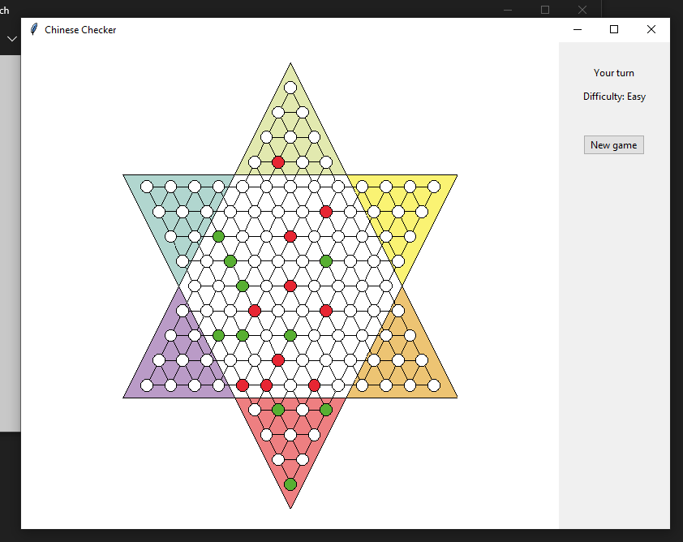
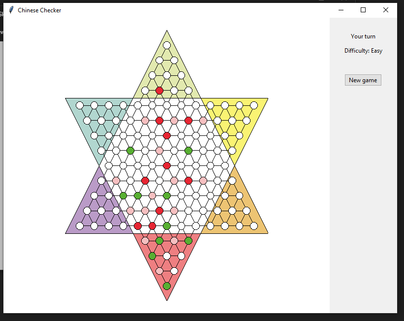

# Chinese checkers bot

Chinese checkers written in python, with [alpha beta pruning](https://en.wikipedia.org/wiki/Alpha%E2%80%93beta_pruning) AI search algorithm. Was made as an assignment for the Artificial Intelligence course taught in Cairo University Faculty of Computers and Artificial Intelligence.

## Features

- 3 levels of difficulty
- Graphical user interface

## Screenshots

## In memory of

We created this project with our friend Mohamed Essam [@moham661](https://github.com/moham661) who passed away during its development.  May he rest in peace.
